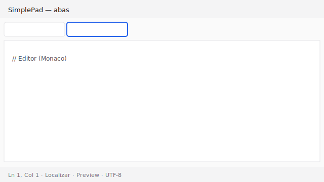
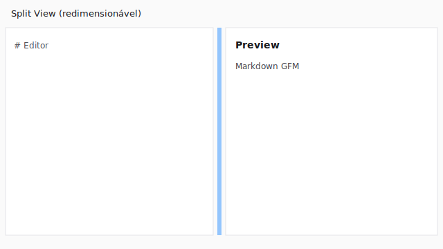

# SimplePad

Editor de texto multiplataforma **minimalista** com abas — inspirado no Bloco de Notas e TextEdit.

**Versão:** [1.7.0](https://github.com/vallades/simplepad/releases/tag/v1.7.0) · **Licença:** [MIT](./LICENSE)

**Stack:** Electron · Vite · React · TypeScript · Monaco · Zustand · Tailwind CSS · electron-store · react-markdown · KaTeX · Mermaid · electron-updater

[](https://github.com/vallades/simplepad/actions/workflows/ci.yml)
[](https://github.com/vallades/simplepad/actions/workflows/release.yml)
[](https://github.com/vallades/simplepad/releases/latest)
[](./LICENSE)

> Simples por design. Poderoso por escolha.

---

## Download (usuários finais)

Instaladores oficiais: **[Releases](https://github.com/vallades/simplepad/releases/latest)**

| Plataforma                | Arquivo típico                                       | Como instalar                                   |
| ------------------------- | ---------------------------------------------------- | ----------------------------------------------- |
| **macOS** (Apple Silicon) | `simplepad-*-mac.dmg` ou `SimplePad-*-arm64-mac.zip` | Abra o `.dmg` e arraste para **Aplicativos**    |
| **Windows**               | `simplepad-*-setup.exe` (NSIS) ou `*-portable.exe`   | Execute o setup ou o portable                   |
| **Linux**                 | `*.AppImage` ou `*.deb`                              | Torne o AppImage executável ou instale o `.deb` |

### macOS: “SimplePad.app is damaged and can’t be opened”

Isso **não é corrupção do arquivo**. É o **Gatekeeper** do macOS bloqueando apps baixados da internet que ainda **não foram notarizados** pela Apple. Os builds atuais do CI **não incluem** code signing / notarização (exige [Apple Developer Program](https://developer.apple.com/programs/) — **US$ 99/ano**).

**Solução rápida (Terminal):**

```bash
# Se o app estiver em Aplicativos:
xattr -cr /Applications/SimplePad.app
open /Applications/SimplePad.app
```

Se estiver em Downloads ou no volume do `.dmg`, use o caminho real do `.app`.

**Pela interface:** clique com o **botão direito** no SimplePad → **Abrir** → confirme. Ou: **Ajustes do Sistema → Privacidade e Segurança** → permita abrir o app.

**Solução definitiva (publicador):** assinatura **Developer ID** + notarização — ver [docs/DISTRIBUTION.md](./docs/DISTRIBUTION.md). Sem conta paga da Apple, o contorno com `xattr` continua necessário para quem baixa o DMG.

---

## O que foi construído (resumo do projeto)

### Fases entregues

| Fase                | Conteúdo                                                                                           |
| ------------------- | -------------------------------------------------------------------------------------------------- |
| **0 — Fundação**    | electron-vite, React, TypeScript strict, ESLint, Prettier, Husky, Vitest, Tailwind                 |
| **1 — MVP**         | Abas (Zustand), Monaco (modelo por aba), sessão persistida, abrir/salvar nativo, menu, quit seguro |
| **1 — Polimento**   | Diálogos nativos (`showMessageBox`), toasts de erro, arquivos recentes                             |
| **2 — Experiência** | Settings (fonte, tema, auto-save), status bar rica, auto-save configurável                         |
| **3 — Markdown**    | Split View Editor \| Preview (GFM), export HTML/PDF, toggle Markdown                               |
| **v1.0**            | Modo distração zero, electron-updater, electron-builder 3 SOs, docs, release                       |
| **CI/CD**           | GitHub Actions (lint, test, matrix build, release em tags)                                         |
| **v1.0.1**          | UX de auto-update (toast + diálogo reiniciar), fixes de CI Windows/mac, docs                       |
| **v1.1**            | Split redimensionável, Find/Replace/Ir à linha, busca multi-aba, CONTRIBUTING, signing docs        |
| **v1.2**            | Templates, auto-save untitled, overflow de abas, drag & drop de arquivos, auto-update robusto      |
| **v1.3**            | Outline, Math (KaTeX), Mermaid, export PDF com opções                                              |
| **v1.4.0**          | Alternar Plain Text ↔ Markdown antes de salvar; extensão .md / .txt automática                     |
| **v1.4.1**          | Outline **à direita do Preview**; largura/toggle persistidos                                       |
| **v1.5**            | Mermaid avançado: tema, export PNG/SVG, zoom/pan, erros amigáveis                                  |
| **v1.7**            | YAML Frontmatter + Properties no Preview (editor body-only)                                        |

### Funcionalidades

- **Abas** com drag & drop (reordenar), indicador dirty (`*`), undo/redo isolado por aba (Monaco)
- **Formato da aba** — **Plain Text** ou **Markdown** (Status Bar / menu da aba / ⌘⇧M); salva em `.txt` ou `.md`
- **YAML Frontmatter** — bloco `---` no arquivo; **Properties** no Preview; editor edita só o corpo
- **Overflow de abas** — botão **…** com lista completa quando há muitas abas
- **Persistência de sessão** — restaura abas, conteúdo (com frontmatter), cursor, scroll e `isMarkdown`
- **Arquivos** — Abrir / Salvar / Salvar como + **Recentes** (máx. 10)
- **Drag & drop** de `.txt` / `.md` do sistema de arquivos → nova aba
- **Templates** — Daily Note, Reunião, Ideia, Checklist (editáveis em Settings)
- **Configurações** — fonte, tema, auto-save, formato da aba, Markdown avançado, Mermaid, Properties, Templates
- **Auto-save** — arquivos no disco **e** rascunhos “Sem título” (`untitled-notes/`)
- **Preview Markdown** — GFM, Properties, Outline (TOC à direita), Math (KaTeX), Mermaid
- **Localizar / Substituir / Ir para linha** (Monaco) + **busca em todas as abas**
- **Exportar** HTML e PDF (PDF: margens, tema, outline)
- **Modo Distração Zero** (F11 / Esc)
- **Auto-update** — verifica no launch (app instalado), baixa e pede reinício
- **Toasts** e confirmações nativas

### Documentação no repositório

| Documento                                                      | Conteúdo                                             |
| -------------------------------------------------------------- | ---------------------------------------------------- |
| [docs/PROJETO.md](./docs/PROJETO.md)                           | Histórico completo, arquitetura, melhorias e roadmap |
| [docs/PROJECT_OVERVIEW.md](./docs/PROJECT_OVERVIEW.md)         | Overview atual (**v1.7**)                            |
| [docs/AUTO_UPDATE.md](./docs/AUTO_UPDATE.md)                   | Como publicar versão e o que o usuário recebe        |
| [docs/DISTRIBUTION.md](./docs/DISTRIBUTION.md)                 | Build, signing, notarização, CI                      |
| [docs/RELEASE_NOTES_v1.4.1.md](./docs/RELEASE_NOTES_v1.4.1.md) | Notas da release 1.4.1                               |
| [CONTRIBUTING.md](./CONTRIBUTING.md)                           | Como contribuir                                      |
| [CHANGELOG.md](./CHANGELOG.md)                                 | Histórico de versões                                 |
| [SimplePad_PRD.md](./SimplePad_PRD.md)                         | PRD original                                         |

---

## Getting Started

### Usuários

1. Baixe o instalador da [Release](https://github.com/vallades/simplepad/releases/latest)
2. **macOS:** se aparecer “app damaged”, rode `xattr -cr /Applications/SimplePad.app` (ver acima)
3. Abra o SimplePad, digite, salve; use **Preview** para Markdown

Capturas de referência (placeholders — substitua por PNGs reais em `docs/screenshots/`):

| Preview                                          | Descrição                       |
| ------------------------------------------------ | ------------------------------- |
|    | Interface com abas e status bar |
|  | Split View redimensionável      |

### Desenvolvedores

**Requisitos:** Node.js 20+ (recomendado **22**), npm 10+

```bash
npm install
npm run dev
```

Veja também [CONTRIBUTING.md](./CONTRIBUTING.md).

### Scripts

| Comando                                        | Descrição                                 |
| ---------------------------------------------- | ----------------------------------------- |
| `npm run dev`                                  | App em desenvolvimento (HMR)              |
| `npm test`                                     | Testes unitários (Vitest)                 |
| `npm run test:coverage`                        | Testes + coverage                         |
| `npm run typecheck`                            | TypeScript strict (main + renderer)       |
| `npm run lint`                                 | ESLint                                    |
| `npm run build`                                | Typecheck + build de produção (`out/`)    |
| `npm run dist`                                 | Instalador da plataforma atual            |
| `npm run dist:mac` / `dist:win` / `dist:linux` | Build por SO                              |
| `npm run dist:all`                             | Tentativa multi-SO (ideal no CI)          |
| `npm run release`                              | Build + publish (precisa de token GitHub) |

---

## Atalhos

| Atalho                       | Ação                        |
| ---------------------------- | --------------------------- |
| `Ctrl/Cmd+N`                 | Nova aba                    |
| `Ctrl/Cmd+O`                 | Abrir                       |
| `Ctrl/Cmd+S`                 | Salvar                      |
| `Ctrl/Cmd+Shift+S`           | Salvar como                 |
| `Ctrl/Cmd+W`                 | Fechar aba                  |
| `Ctrl/Cmd+,`                 | Configurações               |
| `Ctrl/Cmd+Shift+P`           | Toggle Preview / Split View |
| `Ctrl/Cmd+Shift+M`           | Toggle modo Markdown        |
| `Ctrl/Cmd+F`                 | Localizar (Monaco)          |
| `Ctrl/Cmd+Alt+F`             | Substituir (Monaco)         |
| `Ctrl/Cmd+G`                 | Ir para linha               |
| `Ctrl/Cmd+Shift+F`           | Buscar em todas as abas     |
| `Ctrl/Cmd+Tab` / `Shift+Tab` | Alternar abas               |
| `F11`                        | Modo Distração Zero         |
| `Esc`                        | Sair do modo foco           |
| `Ctrl/Cmd+Z` / `Y`           | Undo / Redo (Monaco)        |

**Ajuda → Verificar atualizações…** — checagem manual de updates (app instalado).

---

## Arquitetura

```
src/
├── main/                 # Processo Electron
│   ├── index.ts          # Janela, lifecycle, app.setName
│   ├── ipc.ts            # IPC tipado
│   ├── menu.ts           # Menu nativo
│   ├── sessionManager.ts # session.json
│   ├── preferencesManager.ts
│   ├── fileManager.ts
│   ├── exportManager.ts  # HTML + PDF (printToPDF)
│   ├── updater.ts        # electron-updater
│   └── quitController.ts
├── preload/              # contextBridge → window.api
├── shared/               # Contratos sessão / settings
└── renderer/             # React
    ├── components/       # Editor, Preview, TabBar, StatusBar, Settings, Toasts
    ├── store/            # tabs, settings, toast, ui
    ├── services/         # file, session, auto-save, export, update
    └── monaco/           # setup lazy + model registry
```

### Dados locais (userData)

| Arquivo            | Conteúdo                       |
| ------------------ | ------------------------------ |
| `session.json`     | Abas, conteúdo, cursor, scroll |
| `preferences.json` | Settings + arquivos recentes   |

- **macOS:** `~/Library/Application Support/simplepad/`
- **Windows:** `%APPDATA%/simplepad/`
- **Linux:** `~/.config/simplepad/`

### Segurança Electron

- `contextIsolation: true`, `nodeIntegration: false`
- API exposta só via preload tipado
- **`sandbox: false` no renderer** (temporário) — workers do Monaco; documentado no código
- Export PDF usa janela oculta com sandbox

---

## Auto-update (como o usuário recebe novas versões)

**Importante:** push na `main` **não** atualiza o app dos usuários. Só uma **GitHub Release** com instaladores + `latest*.yml`.

```
1. Bump version no package.json (ex.: 1.0.2)
2. Commit + tag v1.0.2 + push da tag
3. Workflow "Release" gera .exe / .dmg / .AppImage + latest*.yml
4. App instalado detecta versão maior → toast → baixa → "Reiniciar agora?"
```

Guia completo: **[docs/AUTO_UPDATE.md](./docs/AUTO_UPDATE.md)**

Não funciona em `npm run dev` — apenas no app **packaged** da Release.

---

## CI/CD (GitHub Actions)

| Workflow                                       | Quando             | O que faz                                                                        |
| ---------------------------------------------- | ------------------ | -------------------------------------------------------------------------------- |
| [**CI**](./.github/workflows/ci.yml)           | Push/PR em `main`  | Lint, typecheck, testes + coverage, build matrix (linux/win/mac) → **Artifacts** |
| [**Release**](./.github/workflows/release.yml) | Tag `v*` ou manual | Instaladores oficiais → **GitHub Release**                                       |

### Detalhes do CI (lições aprendidas)

| Tema               | Comportamento atual                                                                                                        |
| ------------------ | -------------------------------------------------------------------------------------------------------------------------- |
| **Node**           | `22` explícito em todos os jobs                                                                                            |
| **Cancel em main** | **Não** cancela runs em andamento (`cancel-in-progress` só fora de `main`) — evita “operation was canceled” no meio do DMG |
| **Timeout build**  | **60 min** — macOS (Electron + DMG/ZIP) é o mais lento                                                                     |
| **Windows**        | Steps com `shell: bash` + listagens via **Node** — PowerShell quebrava em `2>/dev/null` → `D:\dev\null`                    |
| **Signing no CI**  | Secrets vazios **não** são exportados (evita erro mac “simplepad not a file”)                                              |

### Secrets opcionais (assinatura)

| Secret                        | Uso                    |
| ----------------------------- | ---------------------- |
| `CSC_LINK`                    | Certificado (Win/mac)  |
| `CSC_KEY_PASSWORD`            | Senha do certificado   |
| `APPLE_ID`                    | Conta Apple (notarize) |
| `APPLE_APP_SPECIFIC_PASSWORD` | App-specific password  |
| `APPLE_TEAM_ID`               | Team ID                |

### Publicar uma release

```bash
# 1. package.json version → 1.0.2 + CHANGELOG
git commit -am "chore(release): v1.0.2"
git push origin main

# 2. Tag (dispara Release workflow)
git tag -a v1.0.2 -m "SimplePad v1.0.2"
git push origin v1.0.2
```

Ou: **Actions → Release → Run workflow**.

---

## Build local e tamanho

```bash
npm test && npm run typecheck && npm run lint
npm run dist:mac    # ou dist:win / dist:linux
```

Artefatos em `dist/`. Instaladores ficam tipicamente **~95–115 MB** (Electron + Monaco). Chunks lazy reduzem o shell inicial, mas o runtime Electron domina o tamanho.

---

## Limitações conhecidas

| Limitação         | Detalhe                                                                          |
| ----------------- | -------------------------------------------------------------------------------- |
| Gatekeeper macOS  | App “damaged” sem notarização — usar `xattr -cr` (ver acima)                     |
| Apple Developer   | Assinatura oficial exige **US$ 99/ano**                                          |
| `sandbox: false`  | Necessário para workers Monaco no renderer                                       |
| Instalador grande | Difícil &lt; 70 MB com Electron + Monaco                                         |
| Auto-update       | Só app instalado + Release com `latest*.yml`                                     |
| macOS arm64       | Builds CI atuais focam Apple Silicon; Intel pode precisar de build x64/universal |
| Screenshots       | Pasta `docs/screenshots/` preparada; imagens oficiais ainda pendentes            |

---

## Como contribuir

1. Fork e clone
2. `npm install`
3. Branch: `git checkout -b feat/minha-feature`
4. Commits no estilo [Conventional Commits](https://www.conventionalcommits.org/)
5. `npm test && npm run lint && npm run typecheck`
6. Pull Request (CI deve ficar verde)

---

## Roadmap (pós-v1.0)

- [ ] Code signing + notarização macOS / Authenticode Windows no CI
- [ ] Build macOS **universal** (Intel + Apple Silicon)
- [ ] Screenshots oficiais no README
- [ ] Split redimensionável / preview vertical
- [ ] Tree-shake mais agressivo dos workers Monaco
- [ ] i18n (pt-BR / en)
- [ ] Templates de issue/PR

Histórico de versões: [CHANGELOG.md](./CHANGELOG.md)  
Visão profunda do projeto: [docs/PROJETO.md](./docs/PROJETO.md)

---

## Licença

[MIT](./LICENSE) © SimplePad contributors
